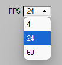

## Game of Life

#### What is the Game of Life?

The Game of Life, also known as Conway's Game of Life or simply Life, is a cellular automaton devised by the British mathematician John Horton Conway in 1970. It is a zero-player game, meaning that its evolution is determined by its initial state, requiring no further input. One interacts with the Game of Life by creating an initial configuration and observing how it evolves. It is Turing complete and can simulate a universal constructor or any other Turing machine. (from [Wikipedia: Conway's Game of Life](https://en.wikipedia.org/wiki/Conway%27s_Game_of_Life))

#### Rules

The universe of the Game of Life is an infinite, two-dimensional orthogonal grid of square cells, each of which is in one of two possible states, live or dead (or populated and unpopulated, respectively). Every cell interacts with its eight neighbours, which are the cells that are horizontally, vertically, or diagonally adjacent. At each step in time, the following transitions occur:

1.  Any live cell with fewer than two live neighbours dies, as if by underpopulation.
2.  Any live cell with two or three live neighbours lives on to the next generation.
3.  Any live cell with more than three live neighbours dies, as if by overpopulation.
4.  Any dead cell with exactly three live neighbours becomes a live cell, as if by reproduction.

The initial pattern constitutes the seed of the system. The first generation is created by applying the above rules simultaneously to every cell in the seed, live or dead; births and deaths occur simultaneously, and the discrete moment at which this happens is sometimes called a tick. Each generation is a pure function of the preceding one. The rules continue to be applied repeatedly to create further generations. (from [Wikipedia: Conway's Game of Life](https://en.wikipedia.org/wiki/Conway%27s_Game_of_Life))

#### What is this project?

This is a free-time project I made in 2023. The goal was to create the cellular automaton in JavaScript using [p5.js](https://p5js.org/). The project deployment is available [here](https://marekblvn.github.io/game-of-life/).

_Recently I decided to add control buttons to the simulation. Originaly it was controlled (pausing, resuming, erasing mode) only by pressing keys on the keyboard._

#### Controls

- **Live and dead cells**

  Dead cells are <ins>white</ins>, live cells are **black**.
   
   

- **Pausing / resuming the simulation**

  You can pause or resume the simulation by pressing the `Play` button:
  <figure align="center">
    
  </figure>
  All other controls are disabled while the simulation is running.
   
   

- **Drawing dead cells**

  While the simulation is paused, you can make cells alive (paint them black) by holding left mouse button while hovering over the dead (white) cells.
   
   

- **Erasing live cells**

  While the simulation is paused, you can make live cells dead (erase them) by pressing the `Erase` button:
  <figure align="center">
    
  </figure>
  This will toggle the erase mode. During erase mode you can hold left mouse button while hovering over live cells, changing them to dead cells.
  The erase mode is automatically turned off when the simulation is resumed.
   
   

- **Inverting the cells**

  You can invert the cells' state by pressing the `Invert` button:
  <figure align="center">
    
  </figure>
  This will make the dead cells alive and the live cells dead.
   
   

- **Restarting the simulation**

  The simulation can be restarted by pressing the `New simulation` button:
    <figure align="center">
    
  </figure>
    This cleans the entire board.
   
   

- **Setting the FPS**

  You can set the visual speed of the simulation by selecting what FPS you want:
  <figure align="center">
    
  </figure>
  This change will only be effective when the simulation is running, not when it is paused. While paused, the loop runs on 60 FPS always.
   
   

 
 

Marek Balvin, 2025
